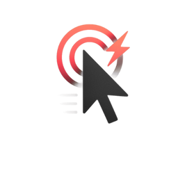

# 🖱️ UzunsClicker-V2

**Modern ve güçlü mouse otomatik tıklama uygulaması**

[📥 **İndir**](https://github.com/OmerUzunsoy/UzunsClicker-V2/releases/latest) • [🐛 **Hata Bildir**](https://github.com/OmerUzunsoy/UzunsClicker-V2/issues) • [⭐ **Yıldız Ver**](https://github.com/OmerUzunsoy/UzunsClicker-V2)

---

## 📖 Özellikler

### ⚡ **Hız Kontrolleri**
- **1-10.000 CPS** arası ayarlanabilir hız
- **Hızlı preset'ler:** 🐌 25, 🏃 500, ⚡ 2500 CPS
- **Gerçek zamanlı emoji göstergesi** (🐢→🚀→⚡)

### 🖱️ **Click Türleri**
- **👆 Sol Click** (Sol mouse tuşu)
- **👉 Sağ Click** (Sağ mouse tuşu)

### 🎯 **Hedef Sistemi**
- **Sınırsız tıklama** (0 = ∞)
- **Hedef belirleme** (100, 1K, özel sayı)
- **Gerçek zamanlı ilerleme takibi** (15/100)

### ⌨️ **Gelişmiş Kısayol Sistemi**
- **Klavye tuşları:** F1-F12, harfler, sayılar
- **Mouse makro tuşları:** Mouse4 (Geri), Mouse5 (İleri), MouseWheel
- **Kombinasyon desteği:** Ctrl+, Shift+, Alt+ + herhangi bir tuş
- **İki çalışma modu:** 🔘 Aç/Kapa veya ⏸️ Basılı Tut

### 🎨 **Modern Arayüz**
- **🌙/☀️ Dark/Light tema** değiştirme
- **🇹🇷/🇬🇧 Türkçe/İngilizce** dil desteği
- **GitHub tarzı modern tasarım**
- **Responsive butonlar** ve smooth animasyonlar
- **Renkli durum göstergeleri** (🔴 Pasif / 🟢 Aktif)

### 📊 **Detaylı İstatistikler**
- **💥 Toplam click sayısı**
- **🎯 Hedef ilerleme göstergesi**
- **⚡ Anlık CPS bilgisi**
- **🔄 Gerçek zamanlı durum güncellemeleri**

---

## 💻 Sistem Gereksinimleri

| Gereksinim | Minimum | Önerilen |
|------------|---------|----------|
| **İşletim Sistemi** | Windows 10 | Windows 11 |
| **.NET Framework** | 4.7.2 | 4.8+ |
| **RAM** | 50 MB | 100 MB |
| **Disk Alanı** | 10 MB | 20 MB |
| **Ekran Çözünürlüğü** | 1024x768 | 1920x1080+ |

---

## 📥 Kurulum

### **🎯 Yöntem 1: Hazır EXE İndirme (Önerilen)**

1. **[Releases](https://github.com/OmerUzunsoy/UzunsClicker-V2/releases/latest)** sayfasına git
2. **`UzunsClicker-V2.exe`** dosyasını indir
3. İndir ve çalıştır
4. İstersen masaüstüne kısayol oluştur

### **🔧 Yöntem 2: Kaynak Koddan Derleme**

     # Repository'yi klonla
     git clone https://github.com/OmerUzunsoy/UzunsClicker-V2.git
    cd UzunsClicker-V2

    # Visual Studio ile aç ve derle
    # Build > Build Solution (Ctrl+Shift+B)

🚀 Kullanım Rehberi

⚡ Temel Kullanım:

Click hızını ayarla (1-10000 CPS)
Click türünü seç (👆 Sol / 👉 Sağ)
Hedef belirle (0 = sınırsız)
▶️ BAŞLAT butonuna tıkla veya kısayol tuşuna bas
⌨️ Kısayol Tuşu Ayarlama:

🎯 Kısayol Tuşu bölümündeki butona tıkla
"Tuşa basın..." mesajını bekle
İstediğin klavye veya mouse tuşuna bas
Kombinasyon örneği: Ctrl tuşuna bas → sonra F5'e bas
Artık o tuş kombinasyonuyla başlat/durdur yapabilirsin
🎨 Tema/Dil Değiştirme:

🌙/☀️ butonu ile Dark/Light tema değiştir
TR/EN butonu ile Türkçe/İngilizce dil değiştir
🔄 Çalışma Modları:

🔘 Aç/Kapa: Tuşa bir kez bas = başlat, tekrar bas = durdur
⏸️ Basılı Tut: Tuşu basılı tuttuğun sürece çalışır
⚙️ Teknik Detaylar

Özellik	Detay
Dil	C# / WPF
Framework	.NET Framework 4.7.2
UI Kütüphanesi	Windows Presentation Foundation (WPF)
Windows API	user32.dll (mouse_event, RegisterHotKey, SetWindowsHookEx)
Tasarım Sistemi	GitHub Modern UI/UX
Mimari	MVVM Pattern
Mouse Hook	Low-level mouse hook (WH_MOUSE_LL)
Hotkey System	Global hotkey registration + Mouse polling
🔒 Güvenlik & Gizlilik

✅ Açık kaynak - Tüm kod görülebilir ve incelenebilir
✅ Reklam yok - Tamamen temiz yazılım
✅ Veri toplama yok - Hiçbir kişisel veri toplanmaz
✅ İnternet bağlantısı gerektirmez - Offline çalışır
✅ Windows Defender uyumlu - False positive yok
✅ Dijital imza - Güvenilir kaynak

🐛 Bilinen Sorunlar & Çözümler

Sorun	Çözüm
Bazı oyunlarda çalışmıyor	Anti-cheat sistemler engelleyebilir
Administrator yetkisi istiyor	Yönetici olarak çalıştır
Hotkey çalışmıyor	Başka program aynı tuşu kullanıyor olabilir
Windows 7'de açılmıyor	.NET Framework 4.7.2+ yükle
🤝 Katkıda Bulunma

Projeye katkıda bulunmak istiyorsan:

Fork et bu repository'yi
Feature branch oluştur (git checkout -b feature/HarikalOzellik)
Değişikliklerini commit et (git commit -m 'Harika özellik eklendi')
Branch'ini push et (git push origin feature/HarikalOzellik)
Pull Request aç
🎯 Katkı Alanları:

🐛 Bug fix'leri
✨ Yeni özellikler
📚 Dokümantasyon
🌍 Çeviri (dil desteği)
🎨 UI/UX iyileştirmeleri
📋 Değişiklik Notları

🎉 v2.0 (2025-08-10)

✅ Modern GitHub UI tasarımı
✅ Dark/Light tema desteği
✅ Türkçe/İngilizce dil desteği
✅ Mouse makro tuşları desteği (Mouse4, Mouse5, MouseWheel)
✅ Gelişmiş kısayol sistemi (kombinasyonlar)
✅ Responsive buton animasyonları
✅ Renkli durum göstergeleri
✅ Gelişmiş hata yönetimi
✅ Performans optimizasyonları
📅 Gelecek Sürümler:

🔜 Makro kaydı ve oynatma
🔜 Profil sistemi
🔜 Scheduled clicking
🔜 Click pattern'leri
🔜 Multi-monitor desteği
📄 Lisans

Bu proje MIT Lisansı altında lisanslanmıştır. Detaylar için LICENSE dosyasına bakın.

MIT Lisansı Özeti:

✅ Ticari kullanım
✅ Değiştirme
✅ Dağıtım
✅ Özel kullanım
❌ Sorumluluk
❌ Garanti

👨‍💻 Geliştirici

Ömer Uzunsoy

 

⭐ Projeyi Destekle

Projeyi beğendiysen ⭐ yıldız vermeyi unutma!

  

Teşekkürler! 🙏
